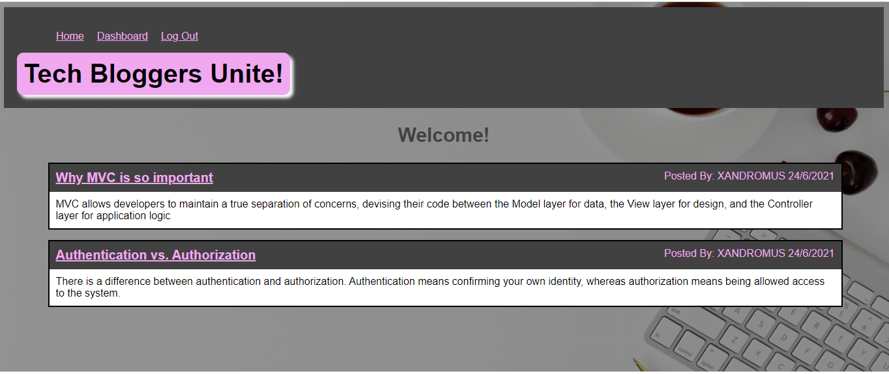
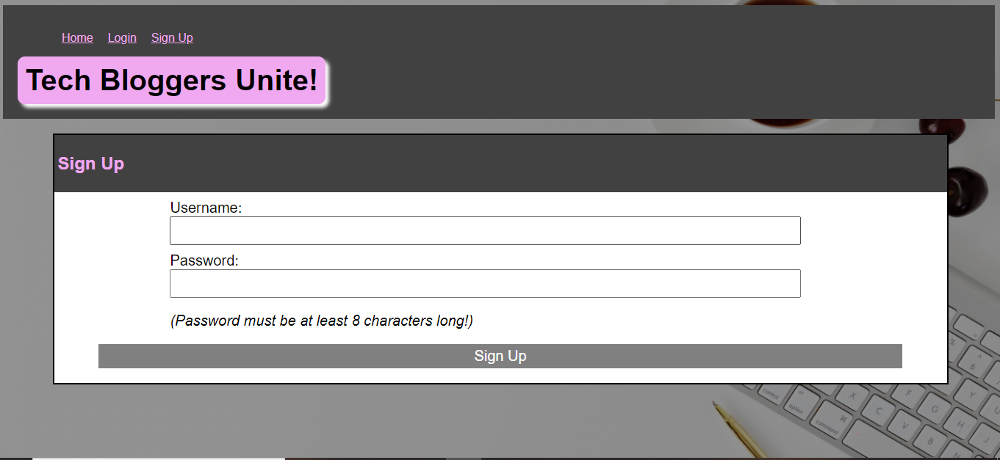
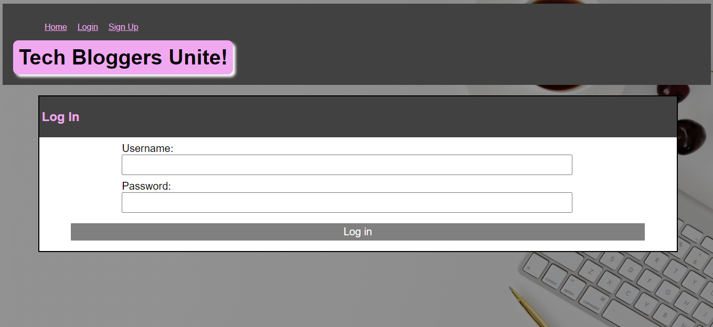
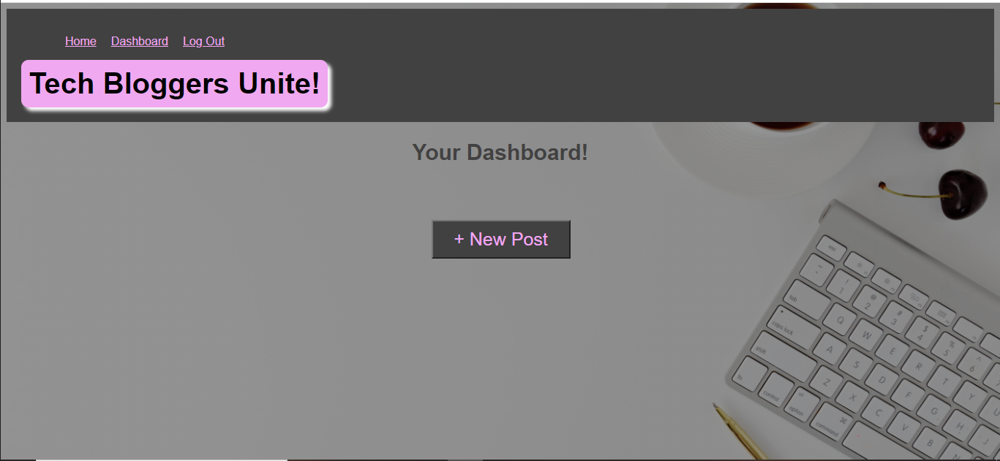
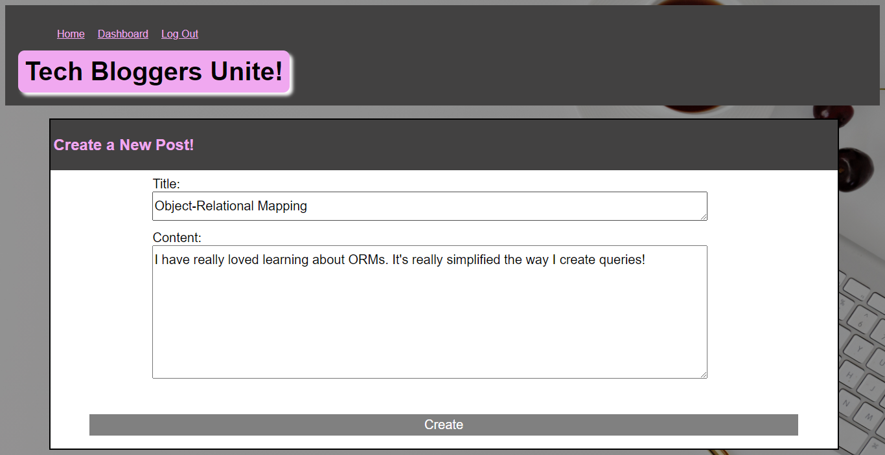
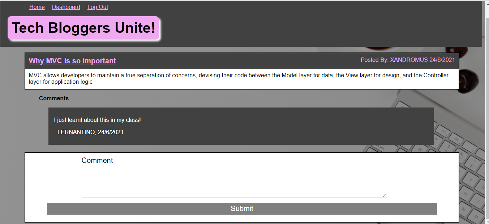
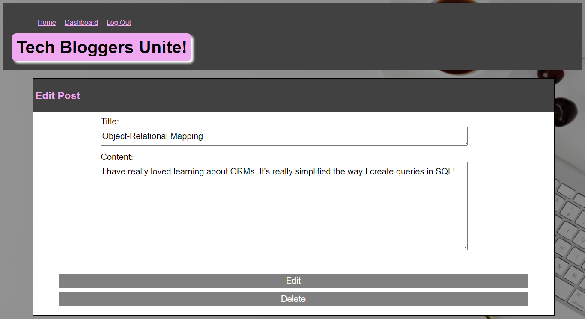

# Tech Bloggers Unite

## Table of Contents

- [Description](#description)
- [Installation](#installation)
- [Usage](#usage)
- [Links](#links)
- [Screenshots](#screenshots)

## Description

Tech Bloggers Unite is great blogging site for a tech lovers to post their tips, tricks tools of the trade!

- MySQL
- Express.JS
- Node.JS
- Handlebars
- Sequelize
- Chalk
- Bycrpt

## Installation

To Install this app onto your own computer:
* Clone the Repository
* Update .env.EXAMPLE with your own database server password and user name (usually "root" for MYSQL) and then save and rename the file to .env
* Open up your terminal and change into the cloned folder
* Type "npm i" to install the dependancies
* Type "mysql -u root -p" and then enter your MYSQL password
* Type "source db/schema.sql" to create the database
* After the database is created type "quit" to exit out of the MYSQL terminal command
* Then lastly type "npm run watch" to start the server!

Otherwise just click on the 'deployed website' link in the Links Section to use the app!

## Usage

* sign up to the site!!
* start posting or comment on someone else's post!

## Links

* gitHub: https://github.com/Kel03-byte/tech-bloggers-unite
* Deployed website: https://tech-bloggers-unite.herokuapp.com/

## Screenshots

Homepage

Sign Up Page

Log In Page

Dashboard Page

Add A New Post Page

Add A Comment Page

Edit A Post Page
